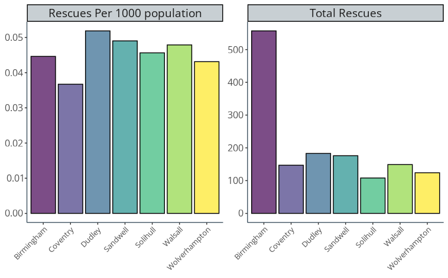
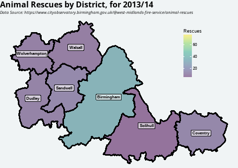

```{r setup, include=FALSE}
library(ragg)
library(tidyverse)
options(htmltools.dir.version = FALSE)
knitr::opts_chunk$set(
  fig.width=9, fig.height=3.5, fig.retina=3,
  out.width = "100%",
  cache = FALSE,
  echo = TRUE,
  message = FALSE, 
  warning = FALSE,
  hiline = TRUE,
  dev = "ragg_png"
)

# Set up
showtext::showtext_auto()
sysfonts::font_add_google("Open Sans", "Open Sans")

# ggplot defaults
theme_set(
  theme_classic(base_family = "Open Sans") +
    theme(
      axis.title = element_text(family="Open Sans"),
      panel.background = element_blank(),
      panel.grid = element_blank(),
      axis.line = element_line(colour ="#425563"),
      strip.background = element_rect(fill = "#c8cfd3"),
      plot.title = element_text(face = "bold", size = 16),
      plot.subtitle = element_text(face = "italic", size = 10)
    )
)

```


class: title-slide

# Animal Rescues in the West Midlands

<br><br>

### Head Data Scientist Interview


<br><br><br><br><br>

###   Dr Chris Mainey

`r icons::icon_style(icons::fontawesome("envelope"), fill = "#005EB8")` [c.mainey@nhs.net](mailto:c.mainey@nhs.net)
`r icons::icon_style(icons::fontawesome("twitter"), fill = "#005EB8")` [@chrismainey](https://twitter.com/chrismainey)
`r icons::icon_style(icons::fontawesome("github"), fill = "#005EB8")` [chrismainey](https://github.com/chrismainey)
`r icons::icon_style(icons::fontawesome("linkedin"), fill = "#005EB8")`  [chrismainey](https://www.linkedin.com/in/chrismainey/)
`r icons::icon_style(icons::fontawesome("orcid"), fill = "#005EB8")` [0000-0002-3018-6171](https://orcid.org/0000-0002-3018-6171)
`r icons::icon_style(icons::fontawesome("globe"), fill = "#005EB8")` [www.mainard.co.uk](https://www.mainard.co.uk)

.footnote[Presentation and code available: **https://github.com/chrismainey/BSICB_interview**]

.art_cap[R generative art - inspired by Antonio Sánchez Chinchón - @aschinchon]


???

__End 30 seconds__!

Say hi - introduce myself

???
Presentation on github with references and code, share afterwards


---

.pull-left[
# Overview

## What? When? 
+ Dataset from WMFS detailing animal rescures
+ No data dictionary, but clear date, District & Ward, free-text description
+ Dates: 02/04/2013 - 31/03/2023 (10 years, likely fiscal years)
+ Numbers are too small to distinguish from chance

<br>
+ Largest numbers seen in: Birmingham
+ Reasonable to assume animal population relates to human population
+ Weighted with ONS population projections
+ Coventry lowest, Birmingham average.
+ Dudley highest


]

.pull-right[
<centre>

<br> 


</centre>


]


---

.pull-left[
# Regional distribution
<br><br><br>
<centre>


]

.pull-right[
<centre>

<br>


</centre>
]

---

# Timeseries problem

+ When decomposed, clear trend and seasonality

---
# NLP / text mining

+ Can use text to work out much of animal distribution.
+ Tokenised to words using `idytext`, stopwords removed.
+ Lots of alternatives (e.g. dog, puppy, terrier etc.) - mapped with function.
+ Majority is cats
+ Majority mention some for of trapped / 
+ Peak in 2022?

---
# What else?

+ No explicit question. What are the questions?
+ Times in the data:
  + Time fo day analysis
  + Is time associated it particular types of rescue/animal?