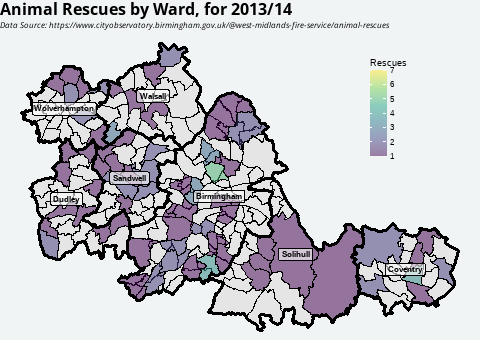

```{r setup, include=FALSE}
library(ragg)
library(tidyverse)
options(htmltools.dir.version = FALSE)
knitr::opts_chunk$set(
  fig.width=9, fig.height=3.5, fig.retina=3,
  out.width = "100%",
  cache = FALSE,
  echo = TRUE,
  message = FALSE, 
  warning = FALSE,
  hiline = TRUE,
  dev = "ragg_png"
)

# Set up
showtext::showtext_auto()
sysfonts::font_add_google("Open Sans", "Open Sans")

# ggplot defaults
theme_set(
  theme_classic(base_family = "Open Sans") +
    theme(
      axis.title = element_text(family="Open Sans"),
      panel.background = element_blank(),
      panel.grid = element_blank(),
      axis.line = element_line(colour ="#425563"),
      strip.background = element_rect(fill = "#c8cfd3"),
      plot.title = element_text(face = "bold", size = 16),
      plot.subtitle = element_text(face = "italic", size = 10)
    )
)

```


class: title-slide

# Animal Rescues in the West Midlands

<br><br>

### Head Data Scientist Interview


<br><br><br><br><br>

###   Dr Chris Mainey
<br><br>

`r icons::icon_style(icons::fontawesome("envelope"), fill = "#005EB8")` [c.mainey@nhs.net](mailto:c.mainey@nhs.net)
`r icons::icon_style(icons::fontawesome("twitter"), fill = "#005EB8")` [@chrismainey](https://twitter.com/chrismainey)
`r icons::icon_style(icons::fontawesome("github"), fill = "#005EB8")` [chrismainey](https://github.com/chrismainey)
`r icons::icon_style(icons::fontawesome("linkedin"), fill = "#005EB8")`  [chrismainey](https://www.linkedin.com/in/chrismainey/)
`r icons::icon_style(icons::fontawesome("orcid"), fill = "#005EB8")` [0000-0002-3018-6171](https://orcid.org/0000-0002-3018-6171)
`r icons::icon_style(icons::fontawesome("globe"), fill = "#005EB8")` [www.mainard.co.uk](https://www.mainard.co.uk)

.footnote[Presentation and code available: **https://github.com/chrismainey/BSICB_interview**]

.art_cap[R generative art - inspired by Antonio Sánchez Chinchón - @aschinchon]


???

__End 30 seconds__!

Say hi - introduce myself

???
Presentation on github with references and code, share afterwards


---

.pull-left-half[
# Overview

## What? When? 
+ Dataset from WMFS detailing animal rescues
+ __No data dictionary__, but clear date, District & Ward, free-text description
+ __Dates:__ 02/04/2013 - 31/03/2023 (10 years, likely fiscal years)
+ Numbers are too small to distinguish differences at ward level over time

]

.pull-right-half[

]

--

.pull-left-half[
+ Largest numbers seen in Birmingham
+ Reasonable to assume animal population relates to human population
+ Weighted with ONS population projections:
  + Coventry lowest, Birmingham average
  + Dudley highest

]
<br>

.pull-right-half[

]


---

.pull-left[
# Regional distribution
<centre>


+ __Ladywood__ - Birmingham (25)
+ __St. Michael's__ - Coventry (18)
+ Including Boardsley Green, Nechells, Perry Bar, Soho & Jewellery quarter, Aston, Bartley Green
+ Sutton Trinity - Birmingham(17), Brierly Hill - Dudley(15)

]
--
.pull-right[
<centre>

<br>


</centre>
]

---
.pull-left[
# Timeseries problem


+ When decomposed: clear increasing trend, annual seasonality, suitable stationarity
+ Examined as both monthly and rolling periods (4-month chosen)
+ Best performance with ARIMA, exponential smoothing worked well.
+ 23/24 = 199, 2024/25 = 208, 2025/26 = 2018  - __625 over three years__

<centre>

</centre>

]

.pull-right[
<centre>

</centre>
]

---


.pull-left[
# NLP / text mining

+ Tokenised to words using `tidytext`, stopwords and numerics removed
+ __Cats are always getting trapped / stuck!__
+ Dogs next, and birds surprisingly high, with lots of alternatives
+ Alternatives (e.g. dog, puppy, terrier etc.) mapped with function.
+ Cats highest >3x higher than others in Birmingham
+ Horses comparatively highest in Walsall.

<p float="left">


</p>

]
--
.pull-right[
<centre>

</centre>

]

---
# What else?

.pull-left[
+ __No explicit question. What are the questions?__

+ __Local (District) forecasts - help planning of resources__

+ __Times in the data:__
  + Time of day analysis
  + Time taken for rescues
  + Is time associated with particular types of rescue/animal?

+ __Compare to other callout data__
  + Relative time taken
  + Effects on availability / opportunity cost

+ __Augment future data capture:__
  + Record animal distinctly
  + Equipment needed
  + Time taken

]

.pull-right[
<br><br><br><br><br><br><br>
<center>
<h1>Any questions?</h1>
</center>
]